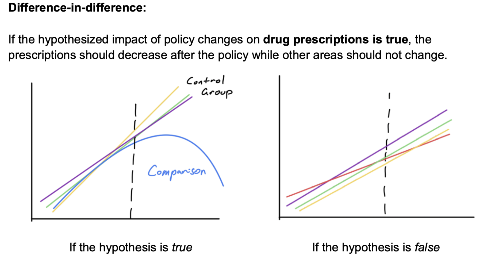

# Effect of Policy Actions on Opioid Prescriptions and Overdose Fatalities

#### Duke University (MIDS) - Fall 2022

#### Team Members: [Pooja Kabber](https://github.com/poojakabber7), [Chenying Li](https://github.com/cl590), [Dingkun Yang](https://github.com/Yer1k), [Andrew Kroening](https://github.com/andrewkroening)

----

## Introduction

This project is an undertaking to measure and estimate the effectiveness of various policy actions to limit the prescription of opioid painkillers in the United States. Over the years, prescription rates have dramatically increased, bringing along higher incedence of addiction and increased overdose fatalities. This project uses data from four sources to examine trends, and changes in trends, in three states following significant changes in policy stance towards opioids:

* Texas: post-2007 regulation changes (measuring overdose fatalities only)

* Florida: post-2010 following significant policy and policing actions

* Washington (State): post-2012 regulation changes

The data was derived from:

* Vitality Statistics Data containing drug-related death counts for counties in the U.S.

* Opioid Shipment Data obtained from a Washington Post FOIA request to the Drug Enforcement Agency

* U.S. Census Data (2010)

* Federal Information Processing System (FIPS) codes obtained from the Federal Communications Commission

## Project Reports

### [Project Strategy](./Project_Strategy.pdf)

The project strategy document outlines the team's approach to solving the analytical problem through a backwards design methodology. The document spells out the hypotheses we are evaluating, namely that we expect to observe decreases in opioid shipments following a policy implementation, as well as an increase in overdose fatalities as addicts turn to other sources. We lay out the data structure needed to accomplish the project, and provide drawings to elaborate on our theories, such as the sample below:

### [Technical Analysis Report](./Technical_Analysis_Report.pdf)

The Technical Analysis Report is the detailed description of the work the team conducted and our methodolgy. It also contains a thorough discussion about the ways that we handled the data, as well as our decisions for dealing with missingness in our samples. The results are analyzed using a *pre-post* and a *difference-in-difference* analysis. We examine each state independently against a comparison group and look at the effects of policies on total opioid shipments and then on unintentional overdose deaths.

### [Policy Impact Report](./Policy_Impact_Report.pdf)

The Policy Impact Report takes the Technical Analysis Report and slims down the technical content to arrive at a document more suited for clients, policymakers, or general consumption. We eschew some of the technical explanations of our methodologies in favor of a direct conversation about what approaches were, and were not, effective. This report echoes the conclusion of the Technical Analysis Report in finding that *some* approaches worked, but certainly not all.
